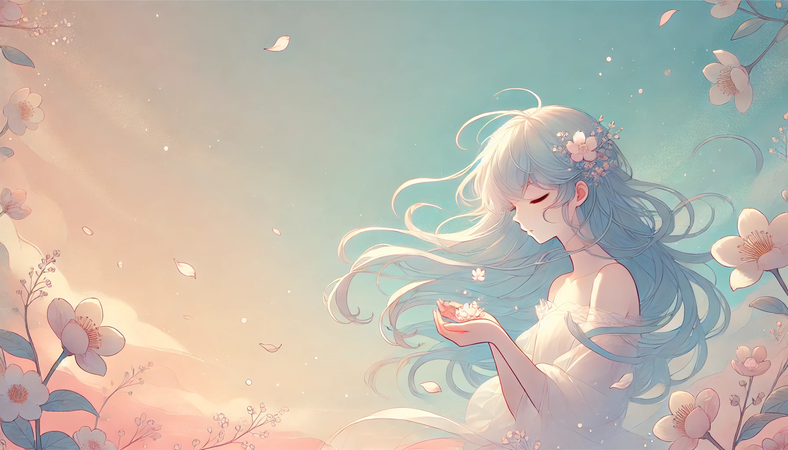
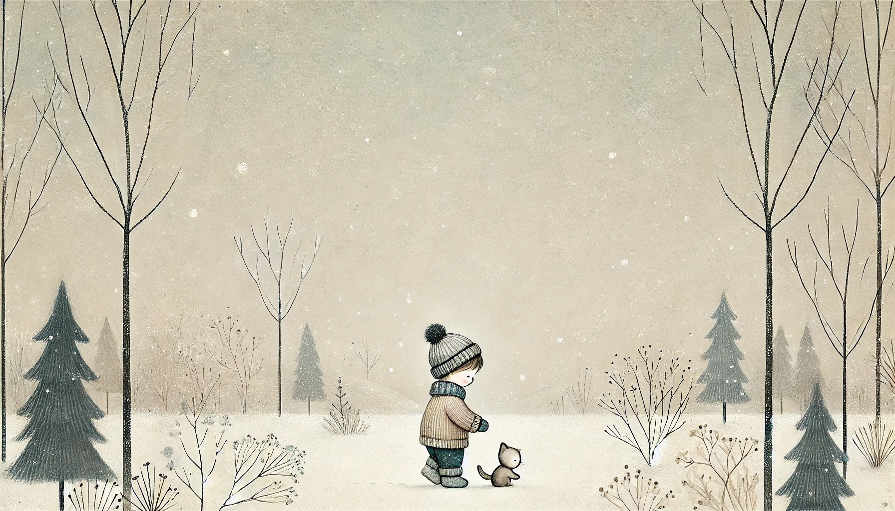
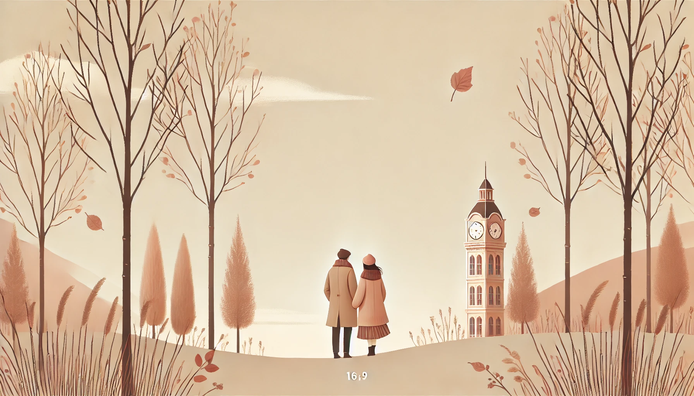
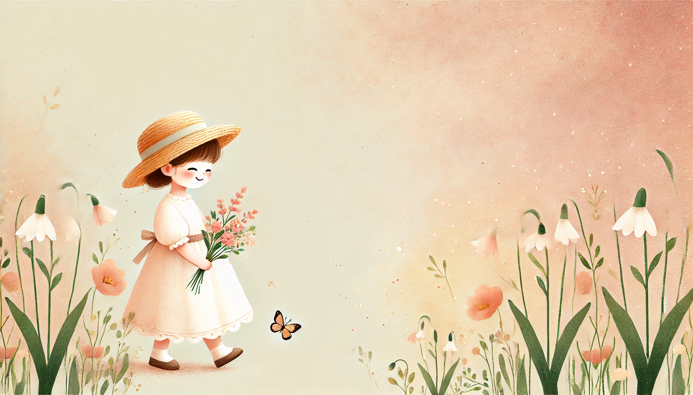
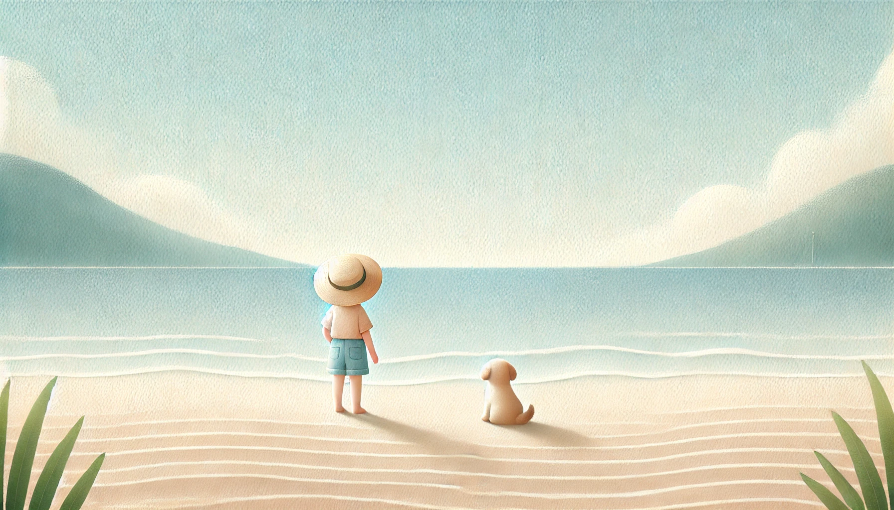
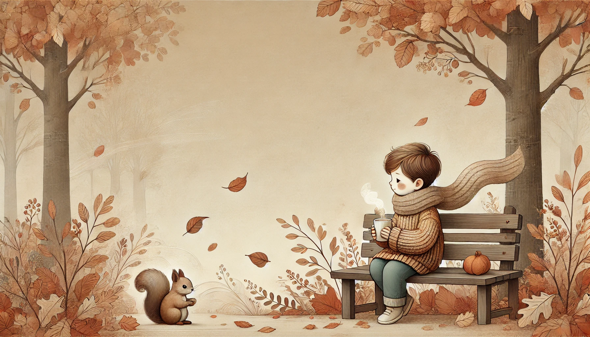
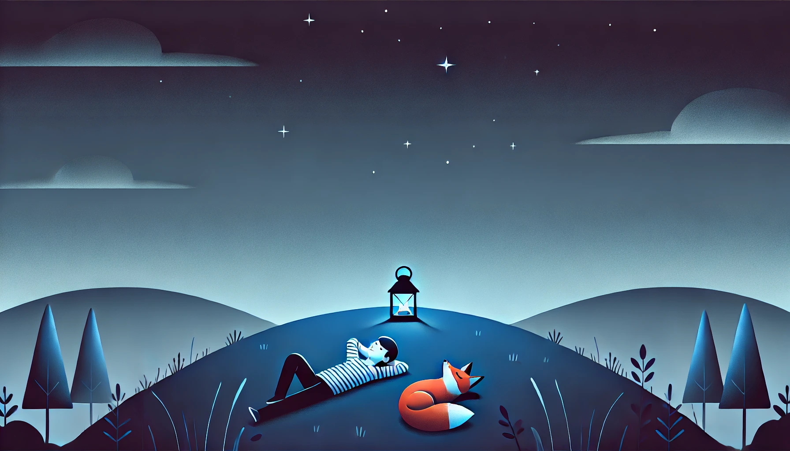
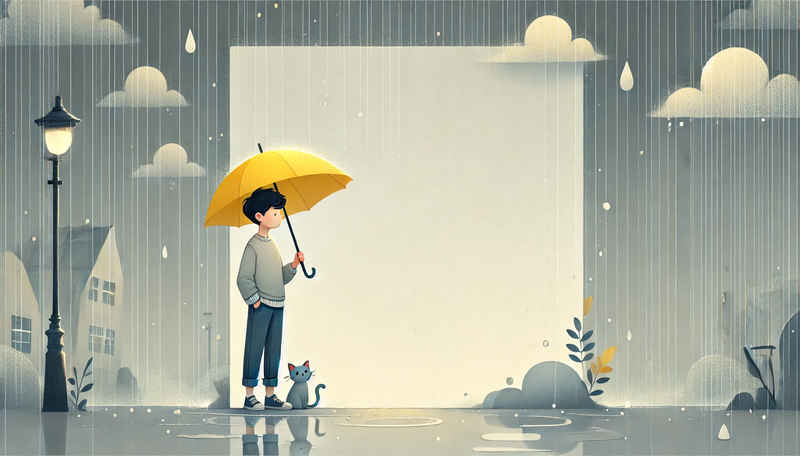

# Setup 

### Template

```
A soft, blank background in a 16:9 aspect ratio with muted, seamless tones occupies all of the space, creating a large open area for text.

Background: 
Illustration: 
```

### Prompt generator

```
You are a illustrator, you have to create a background illustration for a story. First read the story, understand the mood and theme of the story. Then create a background illustration that fits the story.


Output template:
"""
A soft, blank background in a 16:9 aspect ratio with muted, seamless tones occupies all of the space, creating a large open area for text.

Background: <background description>
Illustration: <illustration description>
"""

Example 1:

A soft, blank background in a 16:9 aspect ratio with muted, seamless tones occupies all of the space, creating a large open area for text.

Background: A pale, warm sand color blending seamlessly into a soft blue sky, capturing the essence of a warm summer day.
Illustration: A child with a straw hat, standing with their back facing the viewer, looking out at the waves. A small dog is next to them, wagging its tail. The scene has a carefree, breezy feel, ideal for a summer theme.

Example 2:

A soft, blank background in a 16:9 aspect ratio with muted, seamless tones occupies all of the space, creating a large open area for text.

Background: A muted gray-blue tone with subtle gradients to simulate a rainy day without being too dark.
Illustration: A small figure of a young man holding a bright yellow umbrella, looking down at his reflection in a small puddle. A few soft raindrops fall around him, and a cat peeks out from behind his legs. The rainy ambiance is cozy, and the scene feels introspective.

Example 3:

A soft, blank background in a 16:9 aspect ratio with muted, seamless tones occupies all of the space, creating an open area for text on the left

Background: A soft, pastel pink and cream gradient with warm, seamless tones that blend gently.
Illustration: A small girl in a light dress and straw hat, walking with a gentle smile, holding a bunch of wildflowers. She's accompanied by a small butterfly fluttering nearby. The background shows hints of spring blossoms and green shoots on the ground, evoking the freshness of spring.

```


## Examples



```
a completely blank background image has a 16:9 ratio with soft, muted tones that seamlessly blend into a super tiny illustration occupying the remaining 5% of the space. The artwork show An ethereal anime-style scene of a young woman with flowing pastel blue hair, gazing softly at a small bunch of white and pink flowers. Her hair flows gently in the breeze against a bright, clear blue sky. She exudes calm and peace, with soft petals floating around her in the air. leaving the much space to putting title text The style is light, delicate, and dreamlike, evoking a sense of tranquility and acceptance.
```
---


```
A soft, blank background in a 16:9 aspect ratio with muted, seamless tones occupies 95% of the space, creating an open area for text. In the remaining 5%, a tiny, delicate illustration shows a boy playing with a small cat in a winter scene. They’re surrounded by slender, bare trees, and a few gentle snowflakes drift through the air. The boy is dressed warmly in cozy winter clothing with muted colors like beige, soft blue, and gray. The scene evokes a nostalgic, gentle atmosphere, with the faintest hint of a pale winter sky adding to the calm, peaceful ambiance.
```


---




```
a completely blank background image has 16:9 ratio with soft, muted tones that seamlessly blend into a super tiny illustration occupying the remaining 5% of the space. This artwork shows a couple standing near a European-style clock tower in autumn, surrounded by slender trees with a few falling leaves. The couple, dressed in cozy, light autumn clothing, stands close and affectionate. Warm tones of beige, pink, and brown create a nostalgic, dreamy mood, with a soft sky enhancing the peaceful, gentle atmosphere, leaving open areas for text placement.
```

---



```
A soft, blank background in a 16:9 aspect ratio with muted, seamless tones occupies all of the space, creating an open area for text on the left

Background: A soft, pastel pink and cream gradient with warm, seamless tones that blend gently.
Illustration: A small girl in a light dress and straw hat, walking with a gentle smile, holding a bunch of wildflowers. She's accompanied by a small butterfly fluttering nearby. The background shows hints of spring blossoms and green shoots on the ground, evoking the freshness of spring.
```

---



```
A soft, blank background in a 16:9 aspect ratio with muted, seamless tones occupies all of the space, creating a large open area for text.

Background: A pale, warm sand color blending seamlessly into a soft blue sky, capturing the essence of a warm summer day.
Illustration: A child with a straw hat, standing with their back facing the viewer, looking out at the waves. A small dog is next to them, wagging its tail. The scene has a carefree, breezy feel, ideal for a summer theme.
```

---



```

A soft, blank background in a 16:9 aspect ratio with muted, seamless tones occupies all of the space, creating a large open area for text.

Background: A blend of light browns and oranges, with soft, layered tones hinting at an autumn landscape.
Illustration: A small boy in a knit sweater with a scarf, surrounded by fallen autumn leaves swirling around. He’s sitting on a bench with a warm drink, looking at the colorful leaves, while a squirrel watches him from nearby. The warm tones of autumn evoke comfort and calm.
```

---



```
A soft, blank background in a 16:9 aspect ratio with muted, seamless tones occupies all of the space, creating a large open area for text.

Background: A gradient from deep navy at the top to soft midnight blue, evoking a peaceful night sky.
Illustration: A young person lying on a grassy hill with hands behind their head, looking up at stars. Next to them, a lantern casts a gentle glow, with a fox curled up beside it. The starry sky creates a dreamy, reflective mood, ideal for introspective or nighttime themes.
```

---



```
A soft, blank background in a 16:9 aspect ratio with muted, seamless tones occupies all of the space, creating a large open area for text.

Background: A muted gray-blue tone with subtle gradients to simulate a rainy day without being too dark.
Illustration: A small figure of a young man holding a bright yellow umbrella, looking down at his reflection in a small puddle. A few soft raindrops fall around him, and a cat peeks out from behind his legs. The rainy ambiance is cozy, and the scene feels introspective.
```